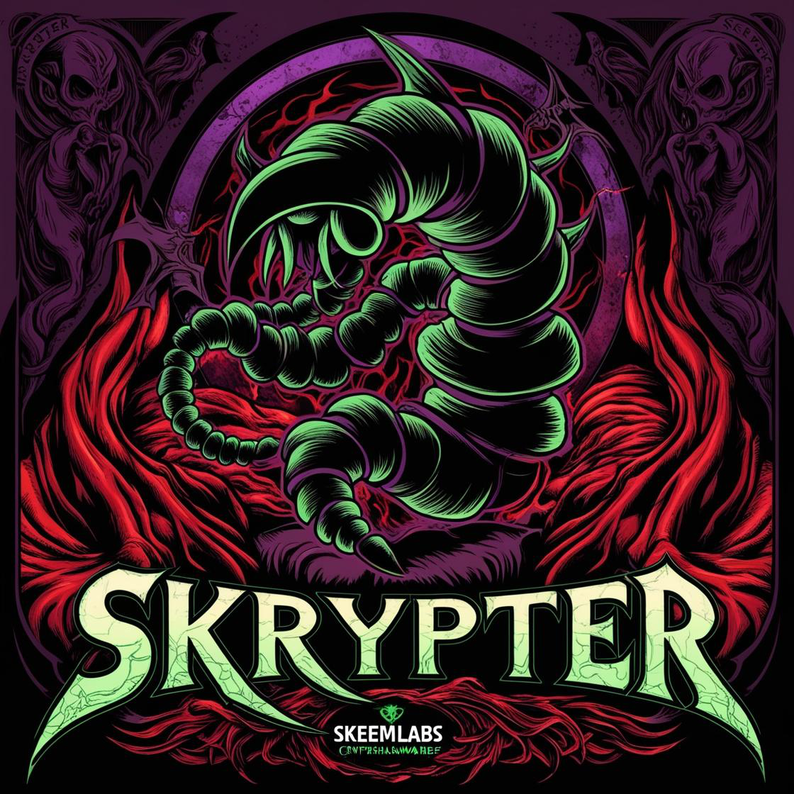

# 🛡️ Skrypter 🛡️

  

# 🛠️ Skrypter | .NET/Native Crypter/Binder (FUD 2025)

Skrypter is a powerful file crypter and binder application that provides robust encryption for your executables. It supports both single-file crypting and multi-file binding with polymorphic encryption techniques designed to maximize FUD (Fully Undetectable) capabilities.

---

### > **[⬇️ Download for Windows](https://github.com/skeeminator/Skrypter/releases/latest)**

---

## ✨ Features

- 🔒 **Single-File Crypter Mode:** Encrypt individual payloads without requiring a second file
- 🧬 **Polymorphic Encryption:** Dynamic encryption that adapts to each file for enhanced FUD capability
- 📦 **Multi-File Binder:** Combine two executables into a single file with independent execution
- 🔐 **Content-Based Key Derivation:** Encryption keys generated based on file content
- 🧩 **Multi-Layered Encryption:** Position-based patterns with selective byte skipping
- ⚙️ **PE Header Preservation:** Special handling for executable compatibility
- 👁️ **File Hiding Options:** Hide dropped files after execution
- 🗑️ **Self-Delete Functionality:** Stub can remove itself after completion
- 🛡️ **AMSI/ETW Patching:** Bypass security monitoring mechanisms

---

## 🔍 Advanced Evasion Techniques

Skrypter employs a comprehensive suite of evasion techniques to ensure maximum FUD capability:

### 🧠 Code Obfuscation
- **String Encryption:** All strings are encrypted using Base64 encoding with dynamic decryption
- **Control Flow Obfuscation:** Logic paths are altered to confuse static analysis tools
- **Rename Protection:** All method and class names are obfuscated to prevent signature detection
- **Anti-De4dot Protection:** Special measures to prevent decompilation by common tools
- **Proxy Strings:** Implementation of string proxying to avoid direct string references
- **Junk Code Injection:** Dynamic insertion of meaningless code to confuse analyzers

### 🛡️ Runtime Protection
- **AMSI Bypass:** Targeted patching of Antimalware Scan Interface to prevent runtime scanning
- **ETW Patching:** Disables Event Tracing for Windows to prevent behavioral monitoring
- **API Obfuscation:** Custom implementation of Windows API calls to avoid direct hooks
- **Function Name Obfuscation:** Dynamic obfuscation of critical function names

### 🎭 Behavioral Evasion
- **Environmental Awareness:** Code that mimics legitimate application behavior
- **Fake Registry Access:** Simulated benign registry operations to mislead heuristic engines
- **Random Execution Paths:** Non-deterministic execution flow to complicate dynamic analysis
- **Sleep Timers:** Strategic delays to evade sandbox analysis
- **Dummy Methods:** Inclusion of benign-looking methods that perform mathematical operations

---

## 📚 Dependencies

To build this project, you need the following dependencies:

- **MetroFramework** - A .NET WinForms framework used for the UI.  
  [Download MetroFramework](https://github.com/thielj/MetroFramework)
  
- **dnlib** - A library to work with .NET assemblies for obfuscation purposes.  
  [Download dnlib](https://github.com/0xd4d/dnlib)

These are included in the project's packages directory.

---

## 🛠️ Build Instructions

1. Open `Builder.sln` in Visual Studio (2019 or newer recommended)
2. Ensure NuGet packages are restored
3. Select Release configuration
4. Build the solution
5. The compiled application will be available in the `Builder/bin/Release` directory

---

## 🚀 Usage Tips

### Single-File Crypter Mode
1. Add your payload file to the "File 1" field
2. Leave "File 2" empty
3. Configure stub settings as needed
4. Check "Polymorphic Encryption" for enhanced detection avoidance
5. Build and test the crypted file in a safe environment

### Multi-File Binder Mode
1. Add your primary payload to "File 1"
2. Add your secondary payload to "File 2"
3. Configure execution options for both files
4. Enable advanced options based on your needs
5. Build the combined executable

### Best Practices
- Always test crypted files in a sandboxed environment
- Use unique configurations for each build to maintain FUD status
- Enable polymorphic encryption for maximum evasion capability
- For PE files (like Pulsar), ensure PE header preservation is active

---

## 📸 Screenshots

> 
> 

---

## ⚠️ Disclaimer

**This tool is created for educational purposes only.**  
Any misuse of this project for malicious purposes is strictly prohibited.  
The author is not responsible for any illegal use or damages caused by this tool.

---

## ⚙️ Credits

- **MetroFramework**  
  [MetroFramework on GitHub](https://github.com/thielj/MetroFramework)

- **dnlib**  
  [dnlib on GitHub](https://github.com/0xd4d/dnlib)

- **AMSI Bypass Techniques**  
  [@EvilBytecode on GitHub](https://github.com/EvilBytecode)

- **Developed by:** [@skeeminator](https://github.com/skeeminator)
- **Powered by:** [SkeemLabs](https://github.com/SkeemLabs)

Created by SkeemAI
